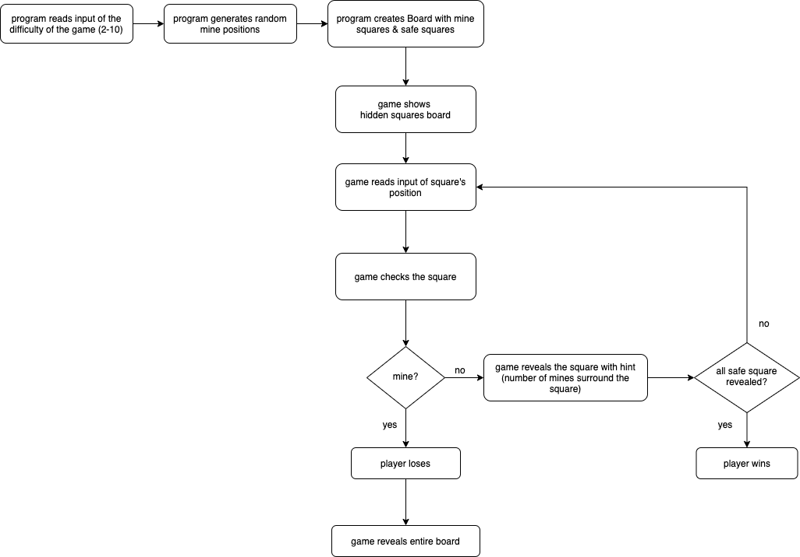
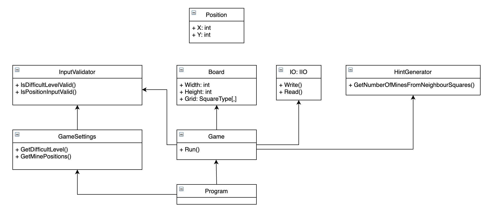

# Minesweeper

## About the kata

The goal of Minesweeper is to uncover all the squares on a board that do not contain mines without being "blown up" by clicking on a square with a mine underneath.  
To help the player, the game shows a number in a square (hint) which tells the player how many mines there are adjacent to that square.  

* * *

## [Kata requirements](./Requirements.md)

## Game Flow Example

    Please enter the difficult level (from 2 to 10): 2
    Here is current board:
    ..
    ..
    Please enter a square position you want to reveal (eg: 0,0 for the square at the first row and first column):0,0
    Here is current board:
    2.
    ..
    Please enter a square position you want to reveal (eg: 0,0 for the square at the first row and first column):1,1
    Here is current board:
    2.
    .2

    Congrats! You've won the game!

## Getting started

### System Requirements

-   A command line interface (CLI) such as Command Prompt for Windows or Terminal for macOS
-   This application is built on [.Net Core 5.0.1 SDK](https://dotnet.microsoft.com/download)

### Clone

Clone this repo to your local machine and in the CLI, navigate into the folder containing the solution and type `dotnet restore` to install the package dependencies

```shell
git clone git@github.com:TiffanyHoang/minesweeper.git
cd minesweeper
dotnet restore
```

### Running the game and enjoy 🎮

```shell
dotnet run --project Minesweeper_App
```

### Running the tests 🧪

```shell
dotnet test
```

To run the tests in watch mode

```shell
dotnet watch --project Minesweeper_Tests test 
```

* * *

## Flowchart



## Class diagram



## Potential future features

1.  Auto revealing neighbour safe squares when a safe square is revealed.

2.  Provide a flag toggle option that can be used to mark a potential mine.
