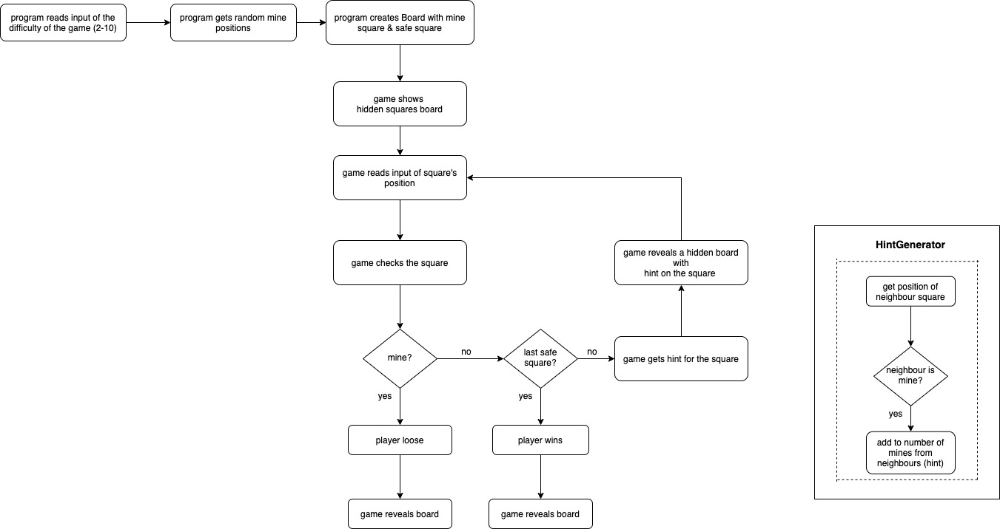

# Minesweeper

## About the kata
The goal of Minesweeper is to uncover all the squares on a board that do not contain mines without being "blown up" by clicking on a square with a mine underneath.  
To help the player, the game shows a number in a square (hint) which tells the player how many mines there are adjacent to that square.  

---
## Kata Requirements 
- A new game should start by specifying the difficult level of the game. Difficult level = Board Width = Board Height = Number of Mines.  
e.g. if board has a difficulty of 4, the board has a width of 4 and a height of 4 and 4 mines
- Mines should be placed randomly
- The board should have two modes of display
    1. Only squares revealed by the player are displayed
    2. The entire revealed board is displayed
- A player should be able to select the difficulty level.
- A player should be able to select the next square to reveal
- If the chosen square is a mine, the game is over and the player loses
- When the player loses, the entire revealed board is displayed
- If the chosen square is not a mine, that square is revealed with the number of mines that surround it, these number are the hints
- If all of the squares are revealed except mines, the player wins

**Validation for position input:**
1. Order of position input: x,y
2. No negative numbers in the input, only integers (excludes characters, symbols)
3. Position must be inside the board
5. x & y are comma separated e.g. 0,1

**Validation for difficult level:**
1. No negative numbers in the input, only integers (excludes characters, symbols)
2. Difficult level is from 2 to 10

## Game Flow Example
~~~
Please enter the difficult level (from 2 to 10): 2
Output:
..
..
Please enter a square position you want to reveal (eg: 0,0 for the square at the first row and first column):0,0
Output:
2.
..
Please enter a square position you want to reveal (eg: 0,0 for the square at the first row and first column):1,1
Output:
Congrats! You win the game!
2*
*2
~~~
---
## Installation
### System Requirements
- A command line interface (CLI) such as Command Prompt for Windows or Terminal for macOS
- [.Net Core 3.1 SDK](https://dotnet.microsoft.com/download) or later. If you have homebrew you can install the latest version of the .NET Core SDK by running the command `brew cask install dotnet-sdk` in the CLI

### Clone
Clone this repo to your local machine and in the CLI, navigate into the folder containing the solution and type `dotnet restore` to install the package dependencies

```shell
$ git clone git@github.com:TiffanyHoang/minesweeper.git
$ cd <your chosen folder>
$ dotnet restore
```

### Running the application
Navigate to the folder called `minesweeper` and run the project using the below commands:

```shell
$ cd minesweeper/
$ dotnet run --project Minesweeper_App
```

### Running the tests
Staying in the folder called `minesweeper`, enter `dotnet test` in your CLI to run the unit tests in the solution

```shell
$ dotnet test
```

----
## Usage
- When prompted "Please enter the difficult level (from 2 to 10):", enter a number to select the difficult level
- The board will display the hidden value square as "."
- To select your chosen square position to reveal, enter two digits separated by a comma 
- If your selected square is not mine, the game shows a number in a square (hint) which tells the player how many mines there are adjacent to that square.
- If your selected square is mine, the game will prompt Lose and reveal the entire board with hints and mines.
- The game will terminate when you reveal all safe square (win) or when you selected square is a mine (lose).

---
## Dependencies
[XUnit](https://xunit.net/) - Testing framework

---
## Flowchart 
